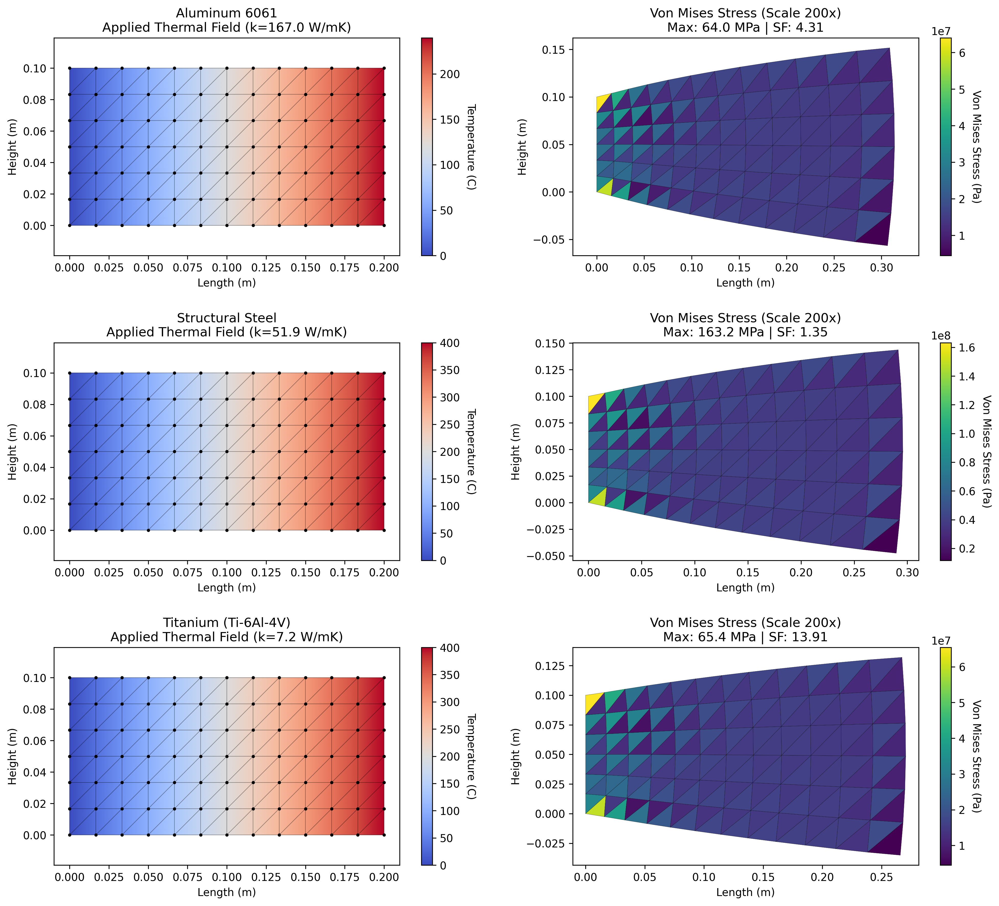

# Finite Element Analysis of Thermal Expansion and Stress in Machine Parts

<p align="center">

</p>

This project develops a Python-based **Finite Element Analysis (FEA)** solver to evaluate the thermomechanical response of solid metal components subjected to machining heat loads. The analysis utilizes **Constant Strain Triangle (CST)** elements to characterize how material-specific thermal properties influence physical deformation and internal stress gradients.

The simulation reveals critical insights, identifying **Aluminum 6061** as the optimal material (Safety Factor **4.31**, Max Temp) while characterizing **Titanium (Ti-6Al-4V)** as a "thermal trap" due to extreme heat localization (Safety Factor 13.91).

This project develops a Python-based Finite Element Analysis (FEA) solver to evaluate the thermomechanical response of solid metal components subjected to machining heat loads. The analysis utilizes Constant Strain Triangle (CST) elements to characterize how material-specific thermal properties influence physical deformation and internal stress gradients.

The simulation reveals critical insights, identifying **Aluminum 6061** as the optimal material (Safety Factor **4.31**, Max Temp) while characterizing **Titanium (Ti-6Al-4V)** as a "thermal trap" due to extreme heat localization (Safety Factor 13.91).

## 📌 Project Overview

In precision manufacturing, machining heat can cause significant thermal expansion, leading to warping, tolerance errors, or catastrophic failure. Predicting these effects before cutting metal is critical for process optimization.

This project addresses this by implementing a numerical Solver that couples steady-state thermal distributions with mechanical stress analysis. By applying a **200,000 W/m² heat flux**, the model quantifies the trade-offs between thermal conductivity and structural stiffness, providing a practical framework for pre-manufacturing material selection.

## 🛠️ Technology Used

* **Language:** Python 3.10+
* **Numerical Computing:** NumPy (Matrix assembly & Linear Algebra)
* **Visualization:** Matplotlib (Contour plotting & Mesh visualization)
* **Methodology:** Finite Element Method (FEM), Direct Stiffness Method
* **Physics:** Fourier Conduction, Linear Elasticity, Von Mises Yield Criterion

## 🔳 Key Features

* **Thermomechanical Coupling:** Integrates a steady-state thermal distribution as the primary driver for mechanical strain, linking heat transfer directly to structural deformation.
* **FEA Implementation:** Built from scratch using the Direct Stiffness Method with CST elements, explicitly handling Global Stiffness Matrix assembly and boundary condition application.
* **Von Mises Failure Analysis:** Calculates the Factor of Safety (SF) for every node to predict yield risks under dynamic machining loads.
* **Material Sensitivity Plot:** Comparative analysis of **Aluminum 6061**, **Structural Steel**, and **Titanium**, highlighting the impact of thermal conductivity (W/mK) on stress generation.

## 📁 Repository Structure

<pre>
├── notebook
│   └── fea_solver.ipynb
├── results
│   └── material_comparison.png
├── LICENSE
├── README.md
└── requirements.txt
</pre>

## 🚀 Getting Started

### 1. Clone the Repository

```bash
git clone https://github.com/YourUsername/FEA-Thermal-Stress-Solver.git
cd FEA-Thermal-Stress-Solver

```

### 2. Install Dependencies

```bash
pip install -r requirements.txt

```

### 3. Run the Simulation

* Navigate to the `notebook` directory.

* Open the `fea_solver.ipynb` file. Run each cell.

*This will generate the mesh, run the solver, and save the resulting plots to the `/results` directory.*

## 📊 Results

The simulation quantified critical stress concentrations at fixed boundaries, revealing distinct material behaviors.

| Material | Conductivity (W/mK) | Max Temp (C) | Max Stress (MPa) | Safety Factor (SF) | Performance Analysis |
| --- | --- | --- | --- | --- | --- |
| **Aluminum 6061** | **167.0** | **239.5** | **64.00** | **4.31** | **Optimal.** Thermally stable and structurally safe. |
| **Structural Steel** | 51.9 | 400.0 | 163.23 | 1.35 | **High Risk.** Stiffness induces dangerous internal stresses. |
| **Titanium (Ti-6Al-4V)** | 7.2 | 400.0 | 65.40 | 13.91 | **Hard-to-Cut.** Structurally safe but suffers from thermal localization. |

## 🤝 Contributing

Contributions are welcome! Potential improvements include:

* Extending the solver to **3D Tetrahedral Elements**.
* Implementing **Transient Heat Transfer** to model time-dependent heating.
* Adding support for non-linear material properties (plasticity).

## 📚 References

ASTM A36 Mild/Low Carbon Steel. (2014). AZoM. https://www.azom.com/article.aspx?ArticleID=6117

Aluminium / Aluminum 6061 Alloy (UNS A96061). (2020). AZoM. https://www.azom.com/article.aspx?ArticleID=6636

Callister, W. D., Jr. & Rethwisch, D. G. (2017). Materials Science and Engineering: An Introduction (10th ed.). Wiley.

Groover, M. P. (2022). Fundamentals of Modern Manufacturing: Materials, Processes, and Systems (International Adaptation). John Wiley & Sons.

KYOCERA SGS Precision Tools Europe Ltd. (2019). Ti-6Al-4V (Grade 5) Titanium Alloy Data Sheet. https://kyocera-sgstool.co.uk/
titanium-resources/titanium-information-everything-you-need-to-know/ti-6al-4v-grade-5-titanium-alloy-data-sheet/
Logan, D. L. (2016). A First Course in the Finite Element Method (6th ed.). Cengage Learning.

Managing Thermal Loads in Milling Processes. (2025). Seco Tools. https://www.secotools.com/article/managing_thermal_loads_in_milling_processes

Ogedengbe, T., Okediji, A. P., Yussouf, A. A., Aderoba, O. A., Abiola, O. A., Alabi, I. O., & Alonge, O. I. (2019). The effects of heat generation on cutting tool and machined workpiece. Journal of Physics: Conference Series, 1378(2), 022012. https://doi.org/10.1088/1742-6596/1378/2/022012

Titanium Alloy 6-4: Definition, History, Properties, and Applications. (2025). Amardeep Steel. https://www.amardeepsteel.com/blog/titanium-alloys-6-4.html

Titanium Alloys - Ti-6Al-4V Grade 5. (2020). AZoM. https://www.azom.com/article.aspx?ArticleID=15475


## 📜 License

This project is licensed under the MIT License - see the `LICENSE` file for details.

If you find this engineering tool useful, please ⭐ the repository!
